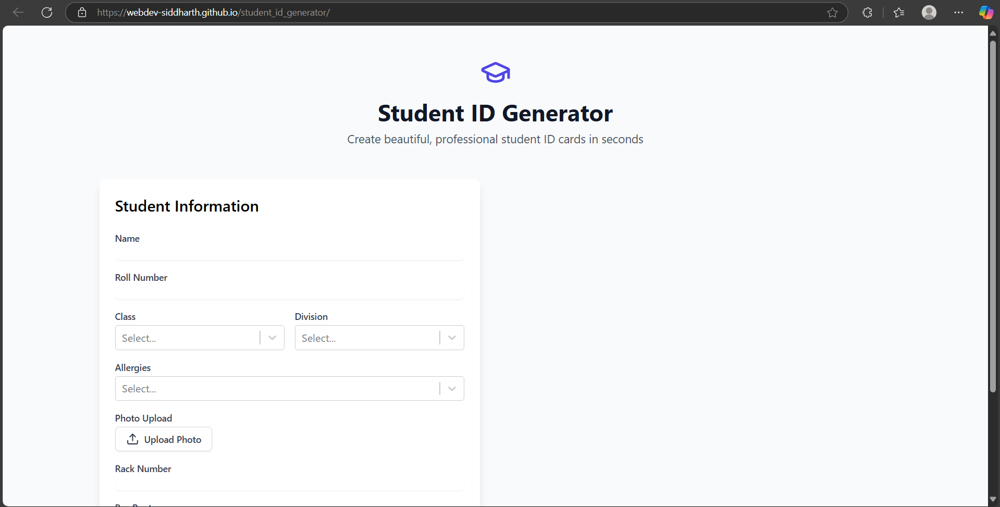

# 🆔 Student ID Generator

A sleek, interactive web app built with **React + Vite** that allows users to generate smart digital student ID cards with customizable templates, QR codes, and real-time previews.


## 🚀 Features

- 🎓 Student form with real-time ID preview
- 🖼️ Multiple ID card templates
- 📸 Upload photo & generate QR code
- 🧠 Persistent data with localStorage (optional)
- 💡 Built with **React**, **Vite**, and **Tailwind CSS**

## 📸 Screenshot

<!-- You can add a screenshot here -->


## 🌐 Live Demo

👉 [Click here to view the live app](https://webdev-siddharth.github.io/student_id_generator/)

## 🛠️ Tech Stack

- React (with Hooks)
- Vite
- Tailwind CSS
- QR Code Generator Library

## 📁 Project Structure

```
student_id_generator/
├── public/
├── src/
│   ├── components/
│   ├── assets/
│   ├── App.jsx
│   └── main.jsx
├── tailwind.config.js
├── vite.config.js
└── package.json
```

## 🧑‍💻 Getting Started Locally

```bash
# Clone the repo
git clone https://github.com/webdev-siddharth/student_id_generator.git

# Navigate into the project
cd student_id_generator

# Install dependencies
npm install

# Run the development server
npm run dev
```

## 📦 Deploy to GitHub Pages

```bash
npm run deploy
```

### 👨‍💻 Author

**Siddharth Vishwakarma**  
[LinkedIn](https://linkedin.com/in/mrsiddharthvishwakarma) • [GitHub](https://github.com/webdev-siddharth)
